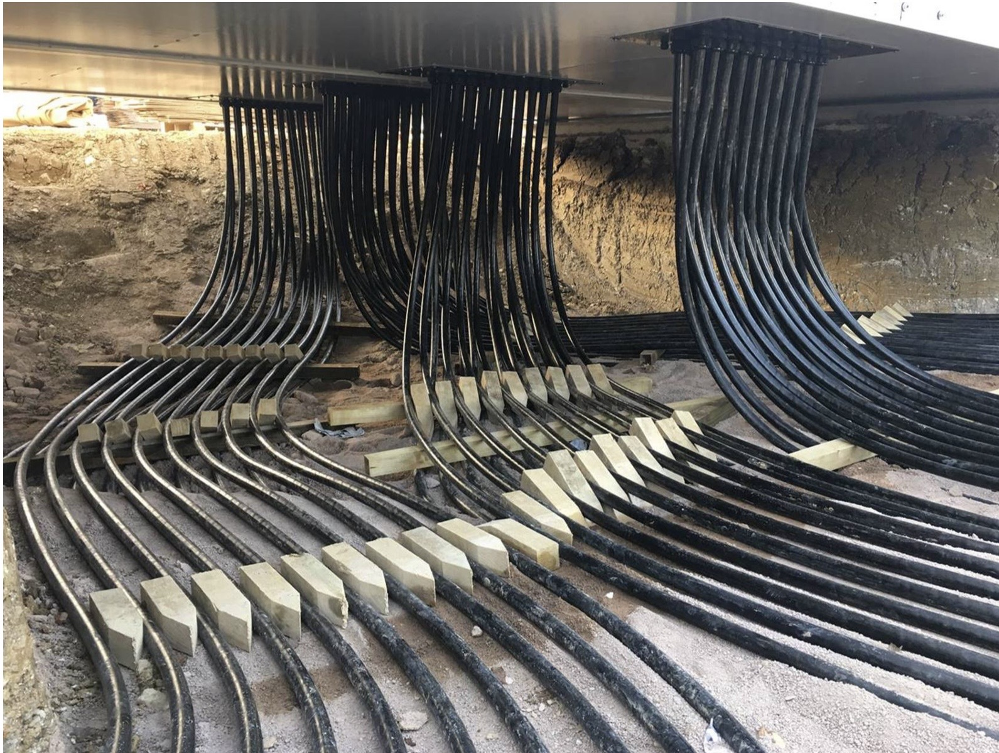

## Grid Scale Battery Energy Storage Systems  
### Project reference: Pelham Battery Energy Storage System - PCS to BESS 

*Installation: [Sphere Electrical](https://www.sphereelectrical.co.uk)* 

*Cable engineering support: [VENTUS Ltd](https://www.ventusltd.com)* ---

## Table of Contents
* [Scope Context](#scope-context)
* [Purpose](#purpose)
* [System Overview and Behaviour](#system-overview-and-behaviour)
* [Standards, Definitions and Conventions](#standards-definitions-and-conventions)
  * [1. Electrical Design Standards](#1-electrical-design-standards)
  * [2. Battery Energy Storage System Standards](#2-battery-energy-storage-system-standards)
  * [3. Power System Study Standards](#3-power-system-study-standards)
  * [4. Cable Design and Thermal Standards](#4-cable-design-and-thermal-standards)
  * [5. Earthing and Safety Standards](#5-earthing-and-safety-standards)
  * [6. Drawing Standards (SLD Format and Structure)](#6-drawing-standards-sld-format-and-structure)
  * [7. Naming, Tagging and Nomenclature](#7-naming-tagging-and-nomenclature)
  * [8. Units and Measurement Conventions](#8-units-and-measurement-conventions)
  * [9. Documentation Consistency Requirement](#9-documentation-consistency-requirement)
* [Engineering Definition Framework](#engineering-definition-framework)
* [Engineering Scope Breakdown](#engineering-scope-breakdown)
* [Total Engineering Effort](#total-engineering-effort)
* [Compliance Position](#compliance-position)
* [Engineering Reality](#engineering-reality)
* [Professional Validation Requirement](#professional-validation-requirement)
* [Disclaimer](#disclaimer)

---

## Scope Context

This example focuses on the cable interface between the Power Conversion System and the Battery Energy Storage System.

Refer to the [Pelham Battery Energy Storage System project video](https://vimeo.com/263759551) for installation context.

Pelham represents an early generation 1 hour duration system and is used here as a reference for electrical architecture rather than modern storage duration.

The sections below define the minimum engineering scope required to achieve:

- compliant Single Line Diagrams  
- validated power system studies  
- bankable electrical design  

for utility scale battery storage systems.

---

## Purpose

To define the engineering scope required to move from concept design to verified electrical system, ensuring:

- compliance with BS 7671 and applicable IEC standards  
- correct protection and fault behaviour  
- thermally and electrically valid cable systems  
- long term reliability and safety  

---

## System Overview and Behaviour

A grid connected utility scale battery energy storage system requires precise definition of both physical architecture and dynamic electrical behaviour. 

### System Architecture and Interfaces
- **Block architecture:** Containerised vs centralised Power Conversion Systems (PCS) and transformer units.
- **Electrical interfaces:** Clear demarcation at the grid connection point, PCS to transformer (LV/MV), PCS to battery (DC), and auxiliary LV supplies.
- **Redundancy and aggregation:** Number of parallel circuits and aggregation methodology at the MV level.

### Power Flow and Control Philosophy
- **Bidirectional operation:** Active and reactive power flow definition across charge and discharge cycles (AC to DC and DC to AC).
- **Control mode:** Grid-following versus grid-forming inverter operation, including frequency response and voltage support capability.

### Fault and Transient Behaviour
- **Fault current paths:** Expected magnitude, duration, and routing of fault contributions from the grid, inverter (PCS), and battery systems.
- **Transient response:** Transformer energisation (inrush), switching transients from MV equipment, and DC-side behaviour during faults or disconnection.
- **Harmonics and power quality:** Expected harmonic injection from power conversion systems, interaction with grid impedance, and requirement for harmonic filtering.

### Cable System and Thermal Environment
- **Cable behaviour:** Parallel cable operation, current sharing, electromagnetic coupling between circuits, and installation geometry impact on inductance.
- **Thermal environment:** Precise definition of installation conditions (buried, ducted, air), factoring in ambient temperature assumptions and the impact of grouping and load diversity.
- **Failure considerations:** Loss of PCS block, cable failure and isolation strategy, protection misoperation scenarios, and thermal overload conditions.

---

## Standards, Definitions and Conventions

### Purpose
To ensure consistency, traceability and compliance across all engineering outputs including Single Line Diagrams, calculations and specifications. All documentation shall align with recognised UK, IEC and international standards.

### 1. Electrical Design Standards
The following standards define the technical basis of design:
* **BS 7671:** Requirements for Electrical Installations. Governs electrical safety, protection, earthing, cable selection and verification.
* **IEC 60364 series:** International basis for low voltage electrical installations and system design principles.
* **BS 7671 Section 712 / IEC 60364-7-712:** Specific requirements for photovoltaic systems where applicable.

### 2. Battery Energy Storage System Standards
There is no single UK BESS design standard, therefore multiple standards apply:
* **IEC 62933 series:** Electrical energy storage systems, system level requirements and performance.
* **IEC 62619:** Safety requirements for lithium ion battery cells and systems.
* **IEC 63056:** Safety requirements for secondary lithium cells in energy storage applications.
* **IEC 62477 series:** Safety requirements for power electronic converter systems.
* **BS EN 50549:** Requirements for generation connected to distribution networks.
* **ENA G99 / G100:** UK grid connection, protection and export limitation requirements.

**IET Guidance (Important Clarification):**
* There is no dedicated IET Code of Practice *solely* for BESS design.
* Relevant guidance is distributed across the IET Wiring Regulations (BS 7671), IET guidance on energy storage and grid integration, and ENA engineering recommendations.
* *Note: BESS design requires the structured integration of multiple standards, not reliance on a single code.*

### 3. Power System Study Standards
* **IEC 60909:** Short circuit calculation methodology (UK and Europe).
* **ANSI C37 series:** Alternative short circuit methods (US based, only where specified).
* **IEC 61000 series:** Electromagnetic compatibility and harmonic limits.

### 4. Cable Design and Thermal Standards
* **BS 7671 Chapter 52:** Cable selection and installation.
* **IEC 60287:** Cable current rating and thermal calculation.
* **Neher McGrath method:** Alternative thermal calculation approach (US).

### 5. Earthing and Safety Standards
* **BS 7671 Chapter 41 and 54:** Protection against electric shock and earthing systems.
* **ENA TS 41-24 / IEEE 80:** Substation earthing and step and touch voltage design (where applicable).

### 6. Drawing Standards (SLD Format and Structure)
The following standards define how electrical diagrams shall be produced:
* **BS EN 61082:** Preparation of electrotechnical documentation and drawings.
* **BS EN 60617:** Graphical symbols for electrical diagrams.
* **IEC 81346:** Reference designations and system structuring.

**SLD Requirements:**
All Single Line Diagrams shall:
* Clearly define system topology and hierarchy.
* Identify all sources, loads and interfaces.
* Show protection devices and ratings.
* Indicate earthing arrangement.
* Be consistent with calculation models and studies.

### 7. Naming, Tagging and Nomenclature
* Equipment tagging shall follow **IEC 81346** principles.
* Consistent naming across SLDs, layouts, studies, and asset registers.
* All identifiers must be unique, traceable, and consistent across all documentation.

### 8. Units and Measurement Conventions
All engineering values shall use SI units. Key conventions:
* **Power:** W, kW, MW
* **Energy:** Wh, kWh, MWh
* **Voltage:** V, kV
* **Current:** A
* **Frequency:** Hz
* **Temperature:** °C
* Time-based performance (e.g. storage duration) shall be clearly defined *(Example: 50 MW / 50 MWh = 1 hour duration).*

### 9. Documentation Consistency Requirement
All outputs must be aligned with the above standards, internally consistent across drawings and studies, traceable to assumptions and calculations, and suitable for independent engineering verification.

**The Bottom Line:** Drawings, calculations and specifications must form a coherent, traceable system definition.

---

## Engineering Definition Framework

### Engineering Basis

Engineering rate: £95 per hour  

All values are indicative and depend on:

- project maturity  
- data availability  
- complexity of grid interface  
- level of prior engineering  

Governance requirements:

- Named Engineer of Record per discipline  
- Independent Checking Engineer with equivalent competence  
- Full traceability of all assumptions and calculations  

---

## Engineering Scope Breakdown

### 1. Core Electrical Definition (SLD and Grid Interface)
Competence: Senior Electrical Engineer (33 kV to 132 kV)  
Hours: 120 to 250  
Cost: £11,400 to £23,750  

### 2. Power System Studies
Competence: Power Systems Engineer  
Hours: 250 to 600  
Cost: £23,750 to £57,000  

### 3. Medium Voltage Cable System Definition
Competence: HV Cable Engineer  
Hours: 150 to 400  
Cost: £14,250 to £38,000  

### 4. DC Cable System (Battery to PCS)
Competence: DC Systems Engineer  
Hours: 100 to 250  
Cost: £9,500 to £23,750  
*Note: Verified thermal study (IEC 60287) required for bankability (£8,000).*

### 5. Low Voltage Distribution Design
Competence: LV Electrical Engineer  
Hours: 80 to 200  
Cost: £7,600 to £19,000  

### 6. Earthing and Bonding Design
Competence: Earthing Specialist  
Hours: 200 to 500  
Cost: £19,000 to £47,500  

### 7. Protection and Control Philosophy
Competence: Protection Engineer  
Hours: 150 to 350  
Cost: £14,250 to £33,250  

### 8. Substation and Switchgear Definition
Competence: Substation Design Engineer  
Hours: 150 to 300  
Cost: £14,250 to £28,500  

### 9. System Integration
Competence: System Integration Engineer  
Hours: 100 to 200  
Cost: £9,500 to £19,000  

### 10. Civil and Cable Installation Interface
Competence: Civil Electrical Interface Engineer  
Hours: 80 to 200  
Cost: £7,600 to £19,000  

---

## Total Engineering Effort

Total hours: **1,380 to 3,250** Total cost: **£131,100 to £308,750** ---

## Compliance Position

A compliant design requires:

- SLD reflecting full system architecture  
- calculations validating protection, thermal and fault behaviour  
- studies confirming real system performance  

Alignment with BS 7671 requires compliance with:

- Part 1 and Part 3 to 5  
- earthing and bonding requirements  
- verification and certification requirements  

---

## Engineering Reality

Without full definition:

- SLD is schematic only  
- cable sizing is assumption  
- earthing is unverified  
- protection is not coordinated  
- system behaviour is unknown  

This results in: non-bankable design, construction risk, and long term failure exposure.

---

## Professional Validation Requirement

All engineering used for procurement or construction must be:

- produced or verified by qualified Chartered Engineers  
- supported by traceable calculations  
- covered by professional indemnity insurance  

---

## Disclaimer

This content is provided for general guidance only. No liability is accepted and no warranty is given for accuracy or completeness. Independent verification and technical due diligence are required prior to any reliance, procurement or construction activity.
