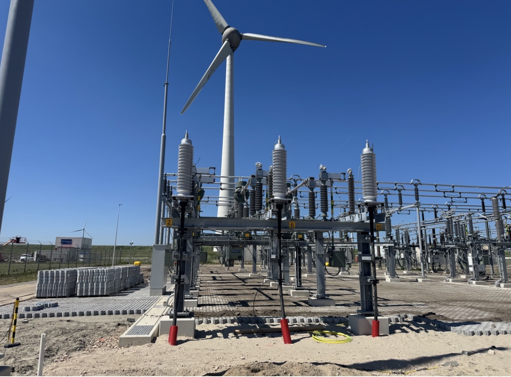

# HV Interface Designs

Most HV connections are bespoke and must be designed around the grid interface requirements and the mechanical configuration of the termination structure.

## 11 kV to 33 kV MV power cables and accessories with Umax 36 kV

Public or private land ownership and transformer termination type must be verified. Where applicable, distribution network operator specifications and relevant standards such as BS 7870 section 4.10 must also be confirmed.

MV power cable technology is well established, however physical installation parameters must still be agreed with cable and accessory suppliers. Cable routing, trench design, thermal environment and termination interfaces must be verified during the design phase.

There is currently a general supply capacity constraint across the MV cable market and manufacturing lead times must be planned well in advance to secure a viable project solution.

Warranty risk must also be carefully managed. Supply chain due diligence, factory acceptance testing and confirmation of product indemnity arrangements should form part of the procurement process. This applies to both cables and accessories including joints, terminations and sealing ends.

---

## Medium Voltage Interface

The Medium Voltage collection network normally operates between 11 kV and 33 kV and forms the electrical interface between inverter transformer stations and the grid export system.

The MV interface typically includes:

- Medium Voltage switchgear or Ring Main Units  
- transformer cable boxes  
- MV power cables  
- cable joints and terminations  
- protection and control wiring  

The interface point between Medium Voltage infrastructure and the export system must be clearly defined in the project design documentation to ensure compatibility of cable terminations, insulation coordination and protection settings.

MV cable systems normally use XLPE insulated screened power cables with aluminium or copper conductors depending on current carrying requirements and installation conditions.

Cable sizing must consider:

- current carrying capacity  
- voltage drop  
- short circuit current withstand  
- installation conditions  
- soil thermal resistivity  

---

## High Voltage Cable Systems

High Voltage export cables are used where power must be transferred from the plant collection network to the transmission network.

For avoidance of doubt, High Voltage typically refers to:

- 110 kV transmission systems in Germany and the Netherlands  
- 132 kV transmission systems and above in the United Kingdom  

High Voltage cable systems are globally regulated through well established engineering standards and grid codes. Despite this, every HV connection is effectively bespoke because cable systems, sealing ends and termination structures must match the specific grid interface design for each project.

Typical HV cable systems include:

- XLPE insulated High Voltage power cables  
- metallic screens or sheaths for fault current return  
- bonding and earthing systems  
- cable joints  
- outdoor or indoor sealing ends  

Cable installation design must consider:

- cable pulling forces  
- minimum bending radius  
- trench or duct installation conditions  
- thermal resistivity of the surrounding soil  
- electromagnetic forces during fault conditions  

Cable identification, segregation and routing must be clearly documented to ensure safe installation and long term maintainability of the electrical system.

---

## Cable Joints and Terminations

Medium Voltage and High Voltage cable systems require specialist jointing and termination procedures to ensure long term insulation integrity.

Termination systems must provide:

- electrical stress control  
- environmental sealing  
- mechanical strain relief  
- compatibility with equipment interfaces  

Cable joints must maintain the electrical and thermal characteristics of the cable system while providing mechanical protection and moisture sealing.

Jointing and termination works are normally carried out by manufacturer certified technicians in accordance with the cable manufacturer installation procedures.

Cable joints and terminations represent the highest statistical risk locations for insulation failure in power cable systems and therefore require strict quality control during installation.

---

## Installation Requirements

Cable installation specifications normally include requirements covering:

- cable pulling forces and bending radius  
- cable identification and labelling  
- conductor phase identification  
- cable containment systems  
- cable cleats and mechanical restraint  
- storage and handling requirements prior to installation  

These requirements ensure that cable systems maintain their designed electrical and thermal performance throughout the installation process.

---

## Supply Chain and Procurement Risk

High Voltage cable systems operate within an even more constrained supply environment than Medium Voltage infrastructure.

Specialist HV cable and accessory manufacturers operate at global scale and typically require a comprehensive engineering scope and commercial commitment before engaging in project supply discussions. This reflects the high technical risk and national infrastructure importance associated with transmission level equipment.

Every High Voltage interface must therefore be treated as a bespoke engineering package requiring early coordination between project developers, transmission system operators and specialist manufacturers.

A significant portion of project cost and risk in High Voltage infrastructure is associated with:

- specialist engineering services  
- multi stage commissioning activities  
- type tested accessories and termination systems  
- manufacturer qualification and supply agreements  

Maintaining established supply relationships with HV manufacturers and engineering contractors is often essential because negotiations with Distribution Network Operators and Transmission System Operators can become technically and commercially complex.

Transmission operators across Europe are currently investing heavily in High Voltage infrastructure expansion. Organisations such as National Grid, TenneT and Terna are undertaking multi billion euro procurement programmes covering:

- transmission reinforcement projects  
- offshore wind grid connections  
- High Voltage Direct Current interconnectors  
- offshore export cable systems  

These programmes compete for the same specialist cable manufacturing capacity and installation expertise required by large renewable generation projects.

Early procurement planning and strong engineering coordination are therefore essential to secure viable delivery schedules for HV cable systems and associated accessories.
