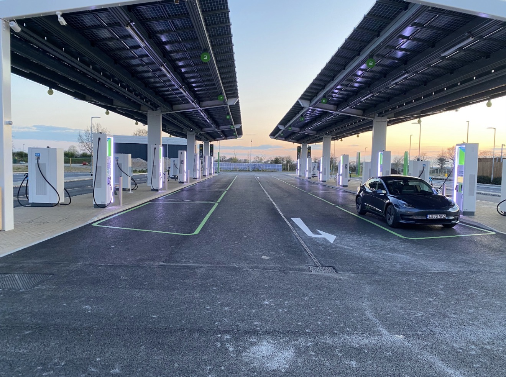
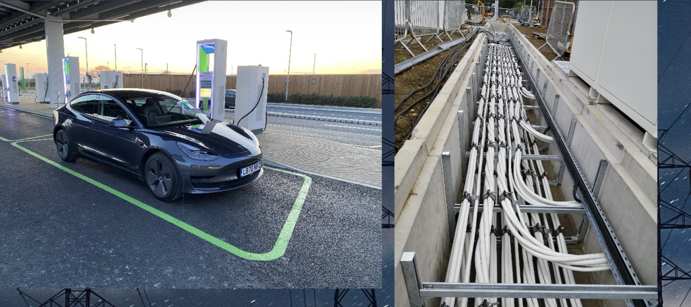

# Power Systems Case Studies

## Braintree EV Forecourt

The Braintree Electric Forecourt opened in December 2020 as the world's first purpose built Electric Forecourt, capable of charging 36 vehicles simultaneously. The facility integrates grid connection, high power electric vehicle charging infrastructure, solar photovoltaic generation and battery energy storage into a single energy hub and was later recognised with major industry awards including the What Car Innovation Award for EV infrastructure.

Gridserve acted as the lead client design and procurement engineers for the project.

Cable engineering and delivery for the site was carried out through collaboration between Studer Cables Switzerland formerly LEONI, myCableEngineering and VENTUS Ltd.

VENTUS Ltd acted as the project management and integration partner responsible for coordinating the cable engineering scope, commissioning the cable studies and managing the commercial negotiations and installation procedures for the cable systems across the site.

### Scope of Cable Engineering

The cable engineering scope covered multiple voltage levels and systems including:

• 33 kV grid connection cables between the customer substation and site substations  
• medium voltage interconnection cables  
• low voltage distribution cables supplying EV charging systems  
• high power DC cables connecting charging cabinets and charge points  
• solar photovoltaic DC string cables connecting PV systems to inverters  
• battery energy storage system DC cables connecting the BESS to the PCS substations  

Cable sizing studies and verification calculations were led and developed by Steven McFadyen using the myCableEngineering platform. These studies verified current carrying capacity, voltage drop, fault withstand capability and installation conditions across the cable systems.

Thermal modelling of the installation conditions was undertaken using IEC 60287 methodology and ETAP cable analysis.

The open air service trench configuration required additional verification where the trench lid was closed. The final thermal modelling of this configuration was completed by Mr Andre Avila of Studer Cables Switzerland using manufacturer cable performance data and installation modelling where the ETAP study could not be completed.

VENTUS Ltd commissioned and managed the delivery of these engineering studies and coordinated the practical engineering required for installation and commissioning.

During installation engineering it was identified that the originally proposed 4 core 240 mm² SWA cables presented practical termination and bend radius constraints within the installation geometry. VENTUS Ltd resolved these constructability issues by coordinating the cable routing, bend radius constraints and installation methodology to enable safe termination and installation within the trench system.

### Key Contributors

**Gridserve – Lead Client Design and Procurement Engineers**

Michael Vassakis  
Sajun Sathyan  
Dragan Gavrilov  

**VENTUS Ltd**

Project management, cable engineering coordination, commercial negotiations, installation methodology and constructability resolution  

**myCableEngineering**

Steven McFadyen – lead cable sizing studies and engineering calculations  

**Studer Cables Switzerland formerly LEONI**

Andre Avila – completion of cable thermal modelling for the closed trough installation condition  

Wolfgang Kessler – cable engineering support  

### Installation and Specialist Support

Steve Cooper, REPL supported the project with Ellis Patent cable cleat systems specified to distribution network operator requirements to maintain several high current cables in critical formation.

Peter Robinson, Robinson & Lawlor managed the installation of the cable systems on site.

